# Train Data Bridge (still working in progress)

Train Data Bridge is a helper library that you import when you want three things solved with minimal code:

1. **Vast.ai launch** – spin up a GPU, clone your repo, `uv sync`, run `run_pipeline(...)`.
2. **Cloudflare R2 uploads** – shard WebDataset/LitData outputs, retry uploads, emit manifests.
3. **Streaming sources** – pull HF/HTTP/R2 data lazily and resume via checkpoints.

Everything else stays in your PyTorch project (Hydra/Lightning launchers, multi-GPU transforms, tokenizers, observability, etc.).

---

## How it fits into a PyTorch workflow

```mermaid
flowchart TD
    A1[Your PyTorch orchestrator] -->|load Settings| A2(run_pipeline / run_from_file)
    A2 --> B1[PipelineFactory]
    B1 --> B2[Pipeline: WebDataset / LitData / custom]
    B2 --> C1[SampleStream]
    B2 --> C2[ProgressTracker]
    B2 --> C3[Optional preprocessing &#40;your code&#41;]
    B2 --> C4[Shard writers]
    C4 --> D1[R2Uploader]
    D1 --> D2[Cloudflare R2 + Manifest]
    A2 -->|--use-vast| V1[Vast.ai Runner]
```



Pipeline lifecycle:
1. Load a `Settings` object from YAML/TOML.
2. `run_pipeline` / `run_from_file` builds the pipeline and opens the stream.
3. Train Data Bridge streams, shards, uploads, checkpoints, and (optionally) provisions Vast.ai.

---

## Install & local development

```bash
uv pip install git+https://github.com/binbinsh/train-data-bridge.git
```

The published package pulls in the upstream `webdataset` and `litdata` wheels, so importing either pipeline works immediately after `pip install train-data-bridge`. The `externals/` directory only matters when hacking on this repo directly.

Working inside this repo:
```bash
uv venv --python 3.12
source .venv/bin/activate             # optional – uv run auto-activates
uv pip install -e ".[dev]"
uv run python -m pytest               # run the focused test suite
```

---

## Embed inside your PyTorch project

```python
from pathlib import Path

from data_bridge import run_pipeline
from data_bridge.config import load_settings


def main() -> None:
    settings = load_settings(Path("configs/webdataset.yaml"))
    manifest_uri = run_pipeline(settings, prefix="runs/2024-11-10")
    if manifest_uri:
        print(f"New shards uploaded to {manifest_uri}")


if __name__ == "__main__":
    main()
```

You own:
- Pre-bridge data munging or PyTorch transforms.
- Orchestration (Lightning/Hydra, schedulers, logging, metrics).
- Secrets for R2/Vast/HF plus your config layering.

Train Data Bridge provides:
- Vast.ai bootstrap (`--use-vast`): clone repo, `uv sync`, run pipeline, tear down.
- Streaming readers (`SampleStream`) + checkpoints (`ProgressTracker`) for HF/HTTP/R2.
- Cloudflare R2 uploader with resumable manifests, per-shard uploads, auto cleanup.

## Configuration basics

```yaml
vast:
  api_key: "${VAST_API_KEY}"
  offer_id: 123456
  image: "docker.io/library/pytorch:2.3.0-cuda12.1-cudnn8-runtime"
  storage_gb: 50
  repo_url: "https://github.com/<org>/your-project.git"
  repo_ref: "main"
  workdir: "/root/train-data"

r2:
  account_id: "${R2_ACCOUNT_ID}"
  access_key_id: "${R2_ACCESS_KEY_ID}"
  secret_access_key: "${R2_SECRET_ACCESS_KEY}"
  bucket: "train-data-bridge"
  region: "auto"

pipeline:
  name: "webdataset"              # or "litdata" or your subclass
  input_uri: "hf://laion/laion2B-en"
  input_format: "huggingface"     # "jsonl" uses smart-open for file/http/s3/r2
  samples_per_shard: 2048
  staging_dir: "/tmp/train-data-bridge"
  source_options:
    split: "train"
    config: "default"
    load_kwargs:
      token: "${HF_TOKEN}"
```

- `pipeline.input_format` controls streaming backend (HF vs JSONL).
- `samples_per_shard` sets shard/chunk size for resume safety.
- `staging_dir` stores checkpoints + pending shards for retry.
- `${VAR_NAME}` entries are expanded from env vars; missing ones raise errors.

See `.env-example` for the required environment variables (R2, Vast.ai, HF token). For Cloudflare bootstrap snippets, check `infra/cloudflare/terraform/main.tf` or `infra/cloudflare/ansible/cloudflare_r2.yml`.

---

## Optional CLI (thin wrapper)

Use it when you need to inspect configs or trigger a run from the shell:

```bash
uv run train-data-bridge init --config configs/example.yaml
uv run train-data-bridge plan --config configs/example.yaml
uv run train-data-bridge run --config configs/example.yaml
uv run train-data-bridge run --config configs/example.yaml --use-vast
```

| Command | Description |
| --- | --- |
| `init` | Emit a starter YAML if the path is empty. |
| `plan` | Print source, format, shard size, R2 prefix, Vast offer. |
| `run` | Process locally: stream, shard, upload, delete, manifest. |
| `run --use-vast` | Re-run remotely via Vast clone + `uv sync`. |

Both the CLI and the Python API call the same underlying pipeline logic.

---

## Architecture map

- `data_bridge.config`: Pydantic models for Vast/R2/pipeline settings.
- `data_bridge.io.sources`: Streaming adapters for HF, smart-open JSONL, R2.
- `data_bridge.utils.progress`: Track next index + pending outputs.
- `data_bridge.pipelines.*`: WebDataset/LitData shard rotation + resume.
- `data_bridge.storage.r2`: Upload shards and write manifests.
- `data_bridge.compute.*`: Vast REST client + remote bootstrapper.
- `data_bridge.cli`: Typer CLI mirroring `data_bridge.api`.
